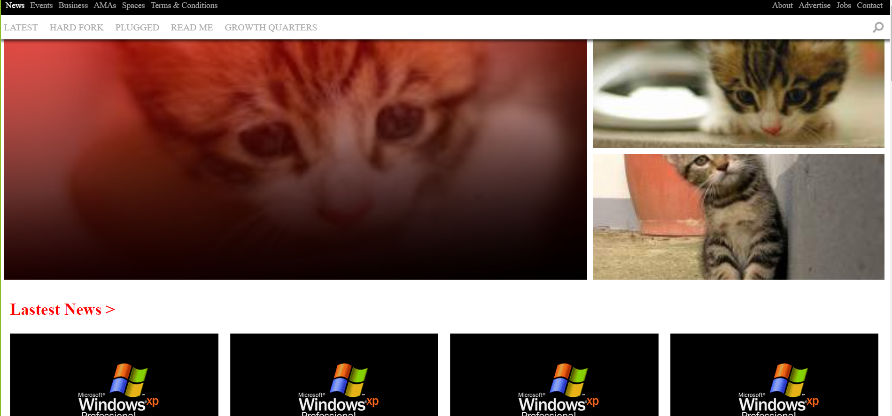

# twn-clone

> Making responsive page using some grids and styling.
> Clone for the TNW page applying responsive design.
> Sixth project on Microverse course.

We cloned [this](https://thenextweb.com/) page using Responsive Design.

It will change at the nexts viewport widths:

- Desktop.
- Ipad/Ipad Pro.
- MotoG4.
- Galaxy S5.
- IPhone.

## Built With

- HTML:
- - Using semantic tags like: main, article, footer.
- CSS:
- - Using styling for Grids and media query to change properties values.
- FONTAWESOME:
- - As a source of Icons.

## Live Demo

Here you will find a Live Demo page, any comment is well recieved.

[Live Demo Link](https://raw.githack.com/MrkarlosM/tnw-clone/Abdo-branch/index.html)

## Authors

Please feel free to contact us in any time:

👤 **Carlos Mario **

- GitHub: [@Carlos](https://github.com/MrkarlosM)
- Twitter: [@Carlos](@MrkarlosM)
- LinkedIn: [LinkedIn](https://www.linkedin.com/in/carlos-mario-martinez-b1768355/)

😎 **Abdo Amin**
- GitHub: [@Abdelrhman-Amin](https://github.com/AbdelrhmanAmin)
- Twitter: [@Abdo-Amin](https://twitter.com/AbdoAmi60489112)
- LinkedIn: [LinkedIn](https://www.linkedin.com/in/abdo-amin-ab786a1b0/)

## 🤝 Contributing

Contributions, issues, and feature requests are welcome!

Feel free to check the [issues page](https://github.com/MrkarlosM/tnw-clone/issues).

## Show your support

Give a ⭐️ if you like this project!
Also advices are well recieved.

## Acknowledgments

- Microverse Team.
- Smashing Magazine.

## 📝 License

This project is [MIT](./LICENSE) licensed.

